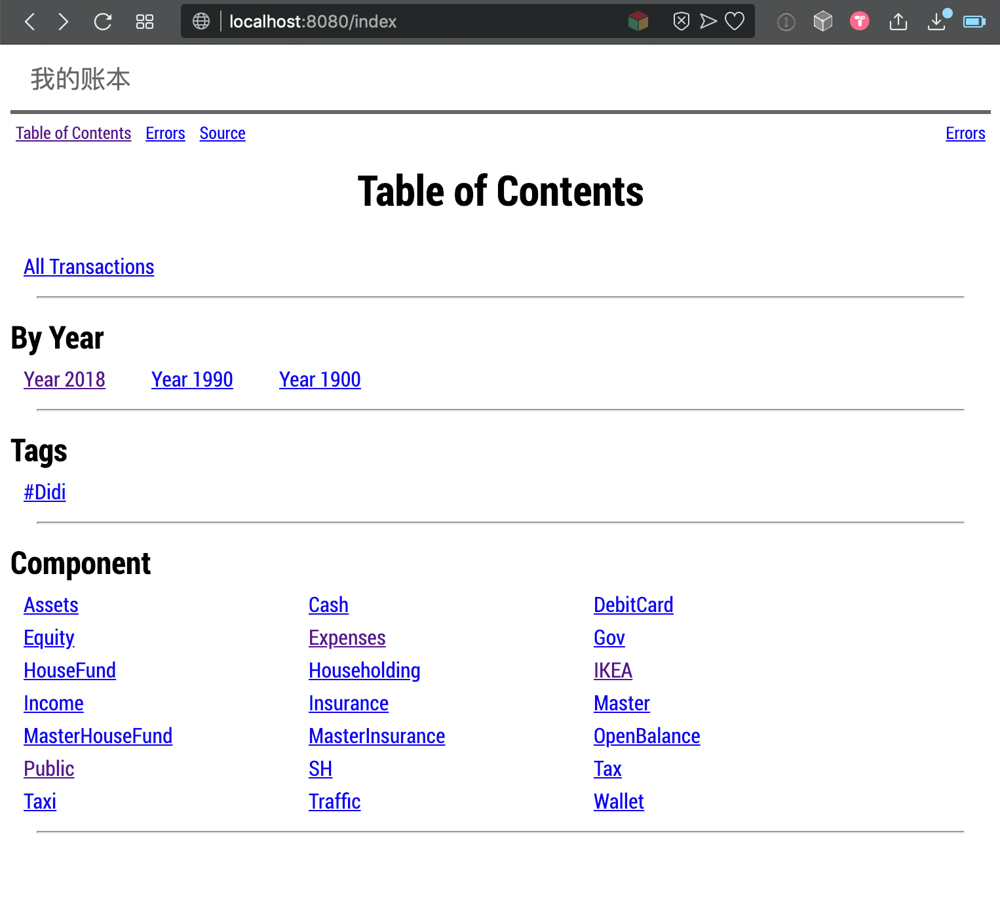
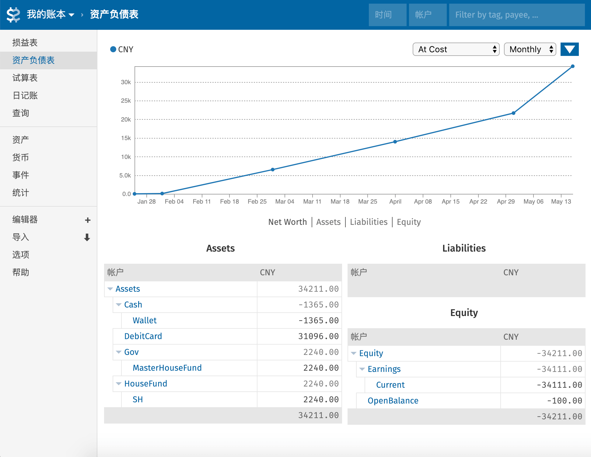

在[上一篇](beancount-tutorial-1)中，我介绍了最简单的 Beancount 账本是如何组织的。今天我们来看看，如果使用 Beancount 自带的命令和第三方图形界面 Fava 来查账。

---

## 使用 Beancount 查询账本

Beancount 的命令都以 bean-* 开头，在 miniconda 的 bin 目录，可以看到有这么一些：

```bash
$ ls bean*
bean-bake     bean-doctor   bean-extract  bean-format   bean-price    bean-report   bean-web
bean-check    bean-example  bean-file     bean-identify bean-query    bean-sql
```

例如，我们可以在终端中使用其中的 `bean-report` 来查询当前账户的净值。查询一下[我们的测试账本](https://github.com/lyricat/beancount-tutorial/)：

```bash
$ bean-report main.bean networth
Currency  Net Worth
--------  ---------
CNY       34,211.00
--------  ---------
```

资产净值为 34211.00 块。

也可以使用 bean-web 这个命令来运行一个简单的图形化程序展示账本。我们运行：

```bash
$ bean-web main.bean
```

然后打开浏览器，访问 `http://localhost:8080/index`，即可看到如下界面。你可以通过点击链接，查看各个功能和账户：




## 使用 Fava 展示账本

虽然 beancount 的命令提供了 beancount 的完整功能，还提供了 bean-web 这个图形界面，但日常我更多使用 fava 这个第三方图形界面。

在 fava 中已经预设了“资产负债表”，“损益表” 等常见财务用表，并且提供很好的图表用于资产可视化，也具备多账本管理、预算管理等 beancount 自己没有的功能，在使用上也更方便一些。

安装 fava 很简单，只需在终端通过 pip 安装即可：

```bash
$ pip install fava
```
日常使用时，只需要在 beancount 账本文件中正常记账，然后调用 fava 运行即可。比如账本入口文件是 main.bean，那么在终端中运行：

```bash
$ fava main.bean
```

默认可以在浏览器 `https://127.0.0.1:5000` 访问 fava 主界面：



实际应用中的账本比这复杂很多。比如 Fava 提供了一个 Demo 站点，你可以在里面看看一个实际账本长什么样子：[Fava Example](http://fava.pythonanywhere.com/example-with-budgets/balance_sheet/)。

### Fava 预设报表

在 Fava 右侧侧边栏，预设了常用报表，稍微解释一下：

- 损益表：呈现利润、收支、收支详情的报表。你可以在这里看到自己赚的、花的、从哪儿赚的钱，都花在哪儿了。
- 资产负债表：呈现净值、资产、负债、权益相关的信息。你可以在看到自己的资产净值、资产、负债和权益。
- 试算表：常用于对账。
- 日记账：以日期方式排序的流水账。
- 资产：查看自己的所有资产（Assets）账户
- 货币：查看所有“货币”对象的走势，例如人民币兑美元走势，需要使用 price 语法告诉 beancount 货币的价格。
- 事件：查看所有事件。例如一次旅行在账本里表现就是一个事件，用 event 语法定义
- 统计：整个账本的统计信息，例如账户内有多少笔转账之类。

在侧边栏下方，可以直接使用 Fava 编辑账本和新增交易，也可以从别的 beancount 账本中导入交易。

如果要设定 Fava 选项，例如中文界面，则需要在 main.bean 中加入以下语句

```beancount
1990-01-01 custom "fava-option" "language" "zh"
```

然后重启 Fava 即可生效了。更多使用方法，可以点击侧边栏的 “帮助” 了解。

